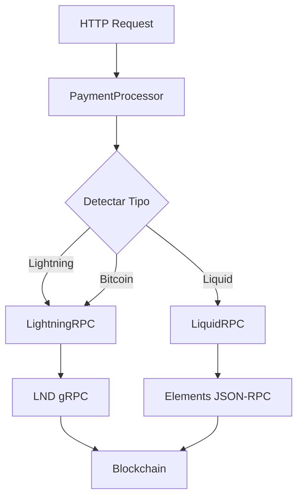

# Documentação Técnica de Desenvolvimento

## 📋 Visão Geral da Arquitetura

Este projeto implementa um servidor de pagamentos multi-chain que utiliza **LND (Lightning Network Daemon)** como cliente principal para transações Bitcoin e Lightning Network, além do **Elements Core** para transações Liquid. 

### Decisões Arquiteturais

1. **LND como cliente unificado**: Elimina a necessidade de Bitcoin Core separado
2. **PaymentProcessor como orquestrador**: Centraliza a lógica de roteamento de pagamentos
3. **Detecção automática**: Identifica tipo de pagamento baseado no formato do destino
4. **Interface HTTP RESTful**: Facilita integração com sistemas externos

## 🏗️ Estrutura de Classes

### PaymentProcessor (Orquestrador Principal)

```javascript
class PaymentProcessor {
  constructor(logger) {
    this.lightningRPC = new LightningRPC(config.lightning, logger);
    this.liquidRPC = new LiquidRPC(config.liquid, logger);
  }
}
```

**Responsabilidades**:
- Roteamento de pagamentos entre LND e Elements
- Detecção automática de tipo de endereço/invoice
- Gestão de arquivos de requisição (pending → sent)
- Consulta unificada de saldos

### LightningRPC (Cliente LND)

```javascript
class LightningRPC {
  // Configuração gRPC com TLS + Macaroons
  initClient() {
    const sslCreds = grpc.credentials.createSsl(lndCert);
    const macaroonCreds = grpc.credentials.createFromMetadataGenerator(...);
    const credentials = grpc.credentials.combineChannelCredentials(sslCreds, macaroonCreds);
    this.client = new lnrpc.Lightning(this.config.host, credentials);
  }
}
```

**Métodos Lightning Network**:
- `sendLightningPayment()` - Pagamentos Lightning via invoice/address
- `resolveLightningAddress()` - Resolução LNURL-pay
- `payInvoice()` - Pagamento direto de invoice
- `createInvoice()` - Geração de invoices
- `decodeInvoice()` - Decodificação de invoices
- `getChannelBalance()` - Saldo dos canais

**Métodos Bitcoin On-chain**:
- `sendOnChain()` - Transações Bitcoin via `sendCoins`
- `getOnChainBalance()` - Saldo da wallet on-chain
- `getNewAddress()` - Geração de endereços
- `estimateFee()` - Estimativa de taxas
- `getTransaction()` - Detalhes de transação específica
- `listTransactions()` - Histórico de transações

**Método Unificado**:
- `sendPayment()` - Detecta automaticamente e roteia para Lightning ou on-chain

### LiquidRPC (Cliente Elements)

```javascript
class LiquidRPC {
  async rpcCall(method, params = []) {
    // Chamadas JSON-RPC tradicionais
    const response = await axios.post(this.rpcUrl, {
      jsonrpc: '1.0',
      method: method,
      params: params
    });
  }
}
```

**Funcionalidades Liquid**:
- Transações confidenciais
- Múltiplos assets (L-BTC, USDt, etc.)
- Compatibilidade total com Bitcoin Core RPC

## 🔌 Interfaces e Protocolos

### Interface gRPC (LND)

```protobuf
service Lightning {
  // Wallet on-chain
  rpc WalletBalance(WalletBalanceRequest) returns (WalletBalanceResponse);
  rpc SendCoins(SendCoinsRequest) returns (SendCoinsResponse);
  rpc NewAddress(NewAddressRequest) returns (NewAddressResponse);
  
  // Lightning Network
  rpc SendPaymentSync(SendRequest) returns (SendResponse);
  rpc AddInvoice(Invoice) returns (AddInvoiceResponse);
  rpc DecodePayReq(PayReqString) returns (PayReq);
  rpc ChannelBalance(ChannelBalanceRequest) returns (ChannelBalanceResponse);
}
```

### Interface JSON-RPC (Elements)

```json
{
  "jsonrpc": "1.0",
  "method": "sendtoaddress",
  "params": ["address", amount, "comment", "comment_to", false, false, null, "unset", null, asset_id],
  "id": "liquid-rpc"
}
```

## 📊 Fluxo de Dados

### 1. Processamento de Pagamentos



### 2. Detecção de Tipo de Pagamento

```javascript
function detectPaymentType(destination) {
  // Lightning invoice (bolt11)
  if (destination.startsWith('ln')) return 'lightning';
  
  // Lightning address
  if (destination.includes('@') && hasDomain(destination)) return 'lightning';
  
  // Bitcoin addresses
  if (isBitcoinAddress(destination)) return 'bitcoin';
  
  // Liquid addresses
  if (isLiquidAddress(destination)) return 'liquid';
}
```

### 3. Roteamento no PaymentProcessor

```javascript
async processPayment(paymentRequest) {
  const network = paymentRequest.network.toLowerCase();
  
  switch (network) {
    case 'bitcoin':
    case 'lightning':
      // LND detecta automaticamente Lightning vs on-chain
      result = await this.lightningRPC.sendPayment(
        paymentRequest.destinationWallet,
        paymentRequest.amount
      );
      break;
      
    case 'liquid':
      result = await this.liquidRPC.sendPayment(
        paymentRequest.destinationWallet,
        paymentRequest.amount
      );
      break;
  }
}
```

## 🔧 Configuração e Autenticação

### Autenticação LND (gRPC + TLS + Macaroons)

```javascript
// 1. Carregar certificado TLS
const lndCert = fs.readFileSync(this.config.tlsCertPath);
const sslCreds = grpc.credentials.createSsl(lndCert);

// 2. Carregar macaroon para autenticação
const macaroon = fs.readFileSync(this.config.macaroonPath).toString('hex');
const metadata = new grpc.Metadata();
metadata.add('macaroon', macaroon);

// 3. Combinar credenciais
const credentials = grpc.credentials.combineChannelCredentials(sslCreds, macaroonCreds);
```

### Autenticação Elements (Basic Auth)

```javascript
const rpcUrl = `http://${config.rpcUser}:${config.rpcPassword}@${config.rpcHost}:${config.rpcPort}`;
```

## 🧪 Testes e Validação

### Estrutura de Testes

```bash
./test.sh
├── Conectividade com servidor
├── Consulta de saldos
│   ├── Bitcoin (via LND)
│   ├── Lightning (via LND)
│   └── Liquid (via Elements)
├── Listagem de pagamentos
└── Envio de pagamento de teste
```

### Validação de Endereços

```javascript
// Bitcoin addresses
const bitcoinRegex = {
  legacy: /^[13][a-km-zA-HJ-NP-Z1-9]{25,34}$/,
  segwit: /^3[a-km-zA-HJ-NP-Z1-9]{25,34}$/,
  bech32: /^bc1[a-zA-HJ-NP-Z0-9]{39,59}$/
};

// Lightning addresses
const lightningRegex = /^[a-zA-Z0-9._%+-]+@[a-zA-Z0-9.-]+\.[a-zA-Z]{2,}$/;

// Lightning invoices
const invoiceRegex = /^ln[a-zA-Z0-9]+$/;
```

## 🎯 Lightning Addresses (LNURL-pay)

### Processo de Resolução

```javascript
async resolveLightningAddress(lightningAddress, amountSats) {
  const [username, domain] = lightningAddress.split('@');
  
  // 1. Fazer requisição LNURL
  const lnurlResponse = await axios.get(
    `https://${domain}/.well-known/lnurlp/${username}`
  );
  
  // 2. Verificar limites de valor
  const amountMsats = amountSats * 1000;
  if (amountMsats < lnurlData.minSendable || amountMsats > lnurlData.maxSendable) {
    throw new Error('Valor fora dos limites');
  }
  
  // 3. Solicitar invoice
  const invoiceResponse = await axios.get(
    `${lnurlData.callback}?amount=${amountMsats}`
  );
  
  return invoiceData.pr; // invoice para pagamento
}
```

### Vantagens das Lightning Addresses

- **User-friendly**: `user@domain.com` em vez de invoices longas
- **Reutilizável**: Mesmo endereço para múltiplos pagamentos
- **Dinâmico**: Valor especificado no momento do pagamento
- **Metadados**: Pode incluir descrição e outras informações

## 📈 Performance e Otimizações

### Conexões Persistentes

```javascript
// LND gRPC - Conexão persistente
this.client = new lnrpc.Lightning(this.config.host, credentials);

// Elements - Pool de conexões HTTP
const axiosInstance = axios.create({
  timeout: 30000,
  keepAlive: true
});
```

### Caching de Dados

- **Saldos**: Cache de 30 segundos para evitar consultas excessivas
- **Estimativas de taxa**: Cache de 60 segundos
- **Informações de canais**: Cache de 5 minutos

### Timeouts e Retry

```javascript
const axiosConfig = {
  timeout: 30000,        // 30 segundos para HTTP
  retry: 3,              // 3 tentativas
  retryDelay: 1000       // 1 segundo entre tentativas
};

const grpcOptions = {
  'grpc.keepalive_time_ms': 30000,
  'grpc.keepalive_timeout_ms': 5000
};
```

## 🔍 Debugging e Logs

### Níveis de Log

```javascript
logger.error('Erro crítico que impede operação');
logger.warn('Aviso que não impede operação');
logger.info('Informação importante sobre fluxo');
logger.debug('Detalhes técnicos para debugging');
```

### Logs Estruturados

```json
{
  "timestamp": "2025-07-19T10:30:00.000Z",
  "level": "info",
  "message": "Pagamento Lightning processado",
  "paymentId": "abc123",
  "destination": "user@domain.com",
  "amount": 1000,
  "txHash": "def456",
  "duration": 1250
}
```

### Debugging gRPC

```javascript
// Habilitar logs gRPC detalhados
process.env.GRPC_VERBOSITY = 'DEBUG';
process.env.GRPC_TRACE = 'all';
```

## 🛠️ Desenvolvimento Local

### Setup Rápido

```bash
# 1. Clonar repositório
git clone <repo> && cd lnd-rpc-py

# 2. Instalar dependências
npm install

# 3. Configurar credenciais
cp config/config.json.example config/config.json
# Editar config.json com suas credenciais

# 4. Iniciar em modo desenvolvimento
npm run dev
```

### Variáveis de Ambiente

```bash
# Desenvolvimento
NODE_ENV=development
LOG_LEVEL=debug
GRPC_VERBOSITY=INFO

# Produção
NODE_ENV=production
LOG_LEVEL=info
GRPC_KEEPALIVE_TIME_MS=30000
```

### Hot Reload

```json
{
  "scripts": {
    "dev": "nodemon src/server.js",
    "start": "node src/server.js"
  }
}
```

## 🔒 Segurança em Produção

### Checklist de Segurança

- [ ] **Certificados TLS válidos** para LND
- [ ] **Macaroons com permissões mínimas** (não usar admin.macaroon em produção)
- [ ] **Chave secreta forte** (256 bits mínimo)
- [ ] **Lista de IPs restritiva** (apenas IPs conhecidos)
- [ ] **Logs sem informações sensíveis** (não logar private keys)
- [ ] **Timeouts apropriados** para evitar ataques de lentidão
- [ ] **Rate limiting** para endpoints públicos
- [ ] **Validação rigorosa** de inputs

### Macaroons Customizados

```bash
# Criar macaroon com permissões específicas
lncli bakemacaroon \
  --save_to ~/.lnd/data/chain/bitcoin/mainnet/payment.macaroon \
  uri:/lnrpc.Lightning/SendPaymentSync \
  uri:/lnrpc.Lightning/WalletBalance \
  uri:/lnrpc.Lightning/ChannelBalance
```

### Monitoramento

```javascript
// Métricas importantes para monitorar
const metrics = {
  uptime: process.uptime(),
  memoryUsage: process.memoryUsage(),
  activeConnections: server.connections,
  paymentsSent: counters.payments,
  errorsCount: counters.errors,
  lndConnection: await this.lightningRPC.ping(),
  elementsConnection: await this.liquidRPC.ping()
};
```

## 📚 Referências Técnicas

### Documentação Oficial

- [LND gRPC API](https://lightning.engineering/api-docs/api/lnd/lightning/index.html)
- [Elements RPC Commands](https://elementsproject.org/en/doc/0.18.1.9/)
- [BOLT 11 (Lightning Invoices)](https://github.com/lightning/bolts/blob/master/11-payment-encoding.md)
- [LNURL Specifications](https://github.com/fiatjaf/lnurl-rfc)

### Dependências Principais

```json
{
  "@grpc/grpc-js": "^1.9.0",     // Cliente gRPC para LND
  "@grpc/proto-loader": "^0.7.0", // Carregador de .proto files
  "express": "^4.18.0",          // Servidor HTTP
  "axios": "^1.5.0",             // Cliente HTTP para Elements
  "winston": "^3.10.0",          // Sistema de logs
  "uuid": "^9.0.0"               // Geração de IDs únicos
}
```

### Códigos de Erro Comuns

| Código | Descrição | Solução |
|--------|-----------|---------|
| `UNAVAILABLE` | LND não acessível | Verificar se LND está rodando e porta correta |
| `UNAUTHENTICATED` | Macaroon inválido | Verificar caminho e permissões do macaroon |
| `INVALID_ARGUMENT` | Parâmetro inválido | Validar formato de endereços e valores |
| `DEADLINE_EXCEEDED` | Timeout | Aumentar timeouts ou verificar conectividade |
| `PERMISSION_DENIED` | Permissões insuficientes | Usar macaroon com permissões adequadas |

## 🚀 Deploy e Produção

### Docker (Recomendado)

```dockerfile
FROM node:18-alpine
WORKDIR /app
COPY package*.json ./
RUN npm ci --only=production
COPY . .
EXPOSE 5002
CMD ["node", "src/server.js"]
```

### Systemd Service

```ini
[Unit]
Description=LND RPC Payment Server
After=network.target lnd.service

[Service]
Type=simple
User=payment-server
WorkingDirectory=/opt/lnd-rpc-py
ExecStart=/usr/bin/node src/server.js
Restart=always
RestartSec=10

[Install]
WantedBy=multi-user.target
```

### Nginx Reverse Proxy

```nginx
server {
    listen 443 ssl;
    server_name payments.example.com;
    
    location / {
        proxy_pass http://localhost:5002;
        proxy_set_header Host $host;
        proxy_set_header X-Real-IP $remote_addr;
    }
}
```

### Backup Strategy

```bash
# Backup crítico
- config/config.json (credenciais)
- logs/ (histórico)
- payment_sent/ (comprovantes)

# Backup LND (separado)
- ~/.lnd/data/chain/bitcoin/mainnet/channel.backup
- ~/.lnd/data/chain/bitcoin/mainnet/wallet.db
```
